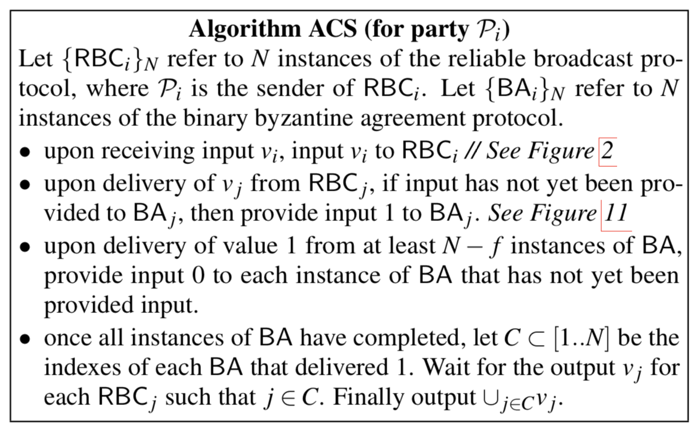
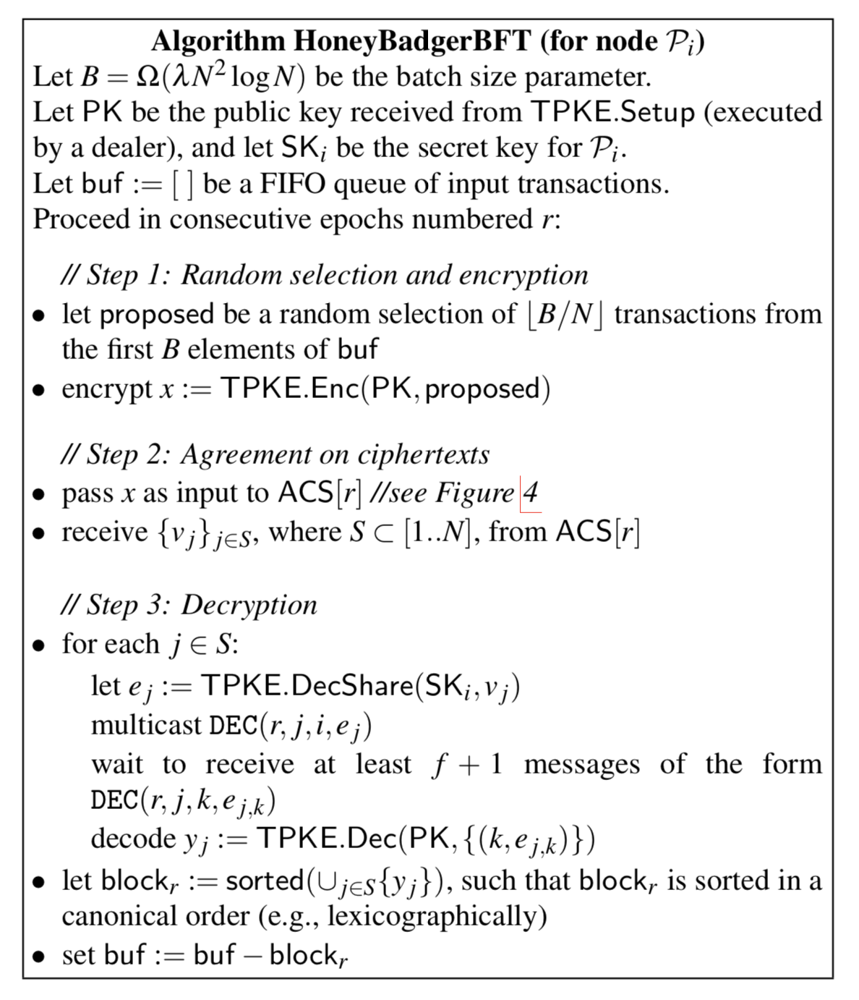
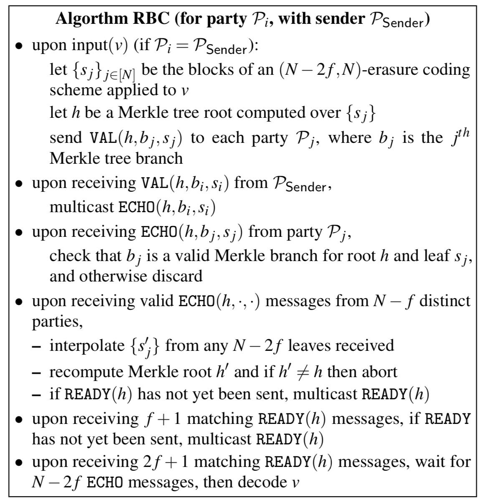
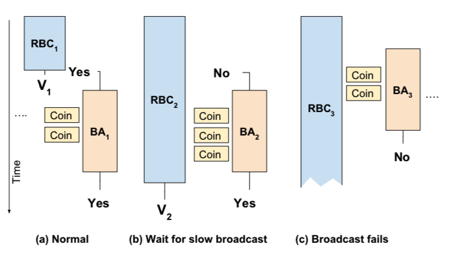
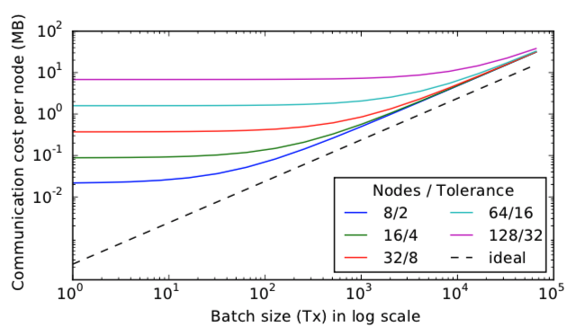
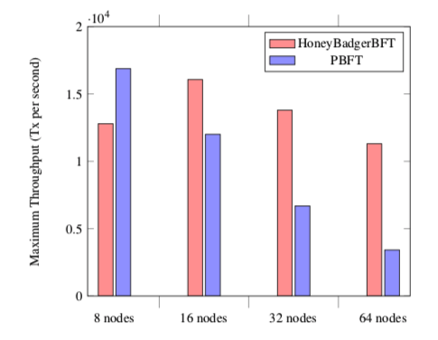

# HoneyBadger BFT Protocol
### 개요
블록체인은 네트워크 상에서 발생하는 모든 트랜잭션을 기록한다. 블록체인을 사용하는 모든 노드들은 다음 블록에 어떤 트랜잭션이 들어가야 할 지에 대한 합의를 해야한다.
이런 과정에서 네트워크는 **비잔틴 장군 문제** 를 해결해야 하고, PBFT와 같은 방법으로 이 문제를 해결하고 있다.
그러나 PBFT는 다음과 같은 문제점을 안고 있다.
* 메세지 전달 간에 타임아웃을 사용하기 때문에 성능이 떨어진다.
* 전체 네트워크가 부담하는 비중이 매우 크기 때문에, 소규모 네트워크에 적합하다.
* 리더 노드가 존재하기 때문에, 탈중앙화에 부합하지 않다.

이런 문제를 해결하기 위해, **HoneyBadgerBFT** 가 제시되었다.
PBFT와 비교했을때, HBBFT는 다음과 같은 특징을 갖는다.
* 타임아웃이 없는, 비동기적인 합의 알고리즘이다.
* PBFT에 비해 네트워크 부하가 적다.
* 리더가 없고, 모든 노드가 동등한 관계이다.

### HoneyBadgerBFT 프로토콜
대부분의 Byzantine fault tolerant(BFT) 시스템에서는 메세지가 *정해진 시간 안에 도착* 해야 한다.
그러나 HBBFT는 이러한 timeout 기반의 로직은 신뢰하기 힘든 네트워크에서 동작하는 분산 시스템, 또는 블록체인에 적합하지 않다고 판단한다.
따라서 HBBFT는 *비동기적인 원자적 브로드캐스트 프로토콜(asynchronous atomic broadcast protocol)* 을 사용한다.

#### 원자적 브로드캐스트 (Atomic Broadcast)
원자적 브로드캐스트의 정의는 다음과 같다.
* Agreement : 어떤 노드가 트랜잭션 tx를 출력하면, 다른 모든 노드들도 tx를 출력해야 한다.
* Total order : 만약 어떤 노드가 {tx(0), tx(1), ..., tx(i)}의 순서로 트랜잭션을 출력했다면, 다른 모든 노드들도 똑같은 순서로 출력해야 한다.* 
* Censorship Resilience : 트랜잭션 tx가 올바른 N-f개의 노드에 입력되면, 결국 모든 올바른 노드에 의해 출력된다.* 

#### 비동기적인 서브셋 ACS(Asynchronous common subset)

<The Honey Badger of BFT Protocols, 2016>

ACS 프로토콜은 다음과 같은 특징을 갖는다.
* Validity : 정상적인 노드가 집합 v를 출력하면, `|v| >= N - f` 를 만족하며 v는 적어도 `N - 2f` 개의 정상적인 노드의 입력를 포함한다.
* Agreement : 정상적인 노드가 v를 출력하면, 모든 노드들 또한 v를 출력한다. 
* Totality : `N - f` 개의 정상적인 노드가 입력을 받으면, 모든 정상적인 노드는 결과물을 출력해야 한다.

#### 임계값 암호화
임계값 암호화는 모든 참여자가 마스터 공용 키로 메세지를 암호화하고, 함께 복호화 하는 암호화 방식이다.
`f + 1` 개의 정상 노드들이 암호문에 대한 해독을 계산하고 공유하면, 평문을 얻을 수 있다.
하나 이상의 정상 노드가 해독 공유를 할 때 까지, 공격자는 평문에 대해 어떤것도 알 수 없다.

#### HoneyBadgerBFT 알고리즘

<The Honey Badger of BFT Protocols, 2016>

원자적 브로드캐스트는 ACS(Asynchronous common subset)의 주요 기능이다.
HoneyBadgerBFT는 더 나은 확장성을 위해 배칭 정책을 다음과 같이 정한다.
1. B는 batch size 이고, 각 단계마다 Ω(B)개의 트랜잭션을 커밋하게 될 것이다.
2. 각 노드는 각자 큐에서 B/N개의 트랜잭션을 제출한다.
3. 노드들이 모두 구분된 트랜잭션을 제출했다는 것을 보장하기 위해, 각자의 큐의 첫번째 원소 B개를 무작위로 선택한다.

ACS의 커뮤니케이션 시간복잡도는 총 `O(N^2|v|+λN^3logN)` 이다. (|v| : 노드의 입력 사이즈)
그래서 여기서는 배치 사이즈 `B = Ω(λN^2 logN)` 로 정하여 `B / N` 개의 노드에서 발생하는 오버헤드를 줄인다.

또한 공격자에 의한 영향을 줄이기 위해, 임계값 암호화 방식을 사용한다.
1. 각 노드는 어떤 트랜잭션 집합을 선택한 후, 암호화한다.
2. 그리고 노드들은 암호화 한 트랜잭션 집합을 ACS의 서브루틴으로 입력한다.
3. ACS가 완료되면 트랜잭션 집합을 복호화된다.

이를 통해 상대방이 각 노드에서 나온 특정 내용을 알기 전에, 트랜잭션 집합을 결정할 수 있다.
또한 상대방이 올바른 노드의 큐의 맨 앞에있는 트랜잭션이 커밋되는 것을 방해하는 행위를 막을 수 있다.

#### 신뢰성 있는 브로드캐스트 RBC : Reliable Broadcast

<The Honey Badger of BFT Protocols, 2016>

HoneyBadgerBFT는 신뢰성 있는 브로드캐스트 알고리즘을 구현하기 위해 Bracha's broadcast를 사용한다.
신뢰성 있는 브로드캐스트는 다음과 같은 성질을 만족한다.

* Agreement : 만약 두 개의 올바른 노드가 v와 v'를 전송하면, v = v' 이다.
* Totality : 만약 어떤 올바른 노드가 v를 전송하면, 모든 올바른 노드가 v를 전송해야 한다.
* Validity : 만약 송신자가 올바른 노드이며 v를 입력받고 있다면, 모든 올바른 노드는 v를 전송해야 한다.

기존의 Bracha's broadcast는 |v|의 크기를 갖는 브로드캐스트 메세지에 대해 O(N^2|v|)의 비트를 필요로 한다.
그러나 ensure-coding을 사용할 경우 이 비용이 최악의 경우에도 O(N|v|+λN^2logN)까지 줄어들 수 있다는 것이 발견되었다.

<The Honey Badger of BFT Protocols, 2016>

위 그림은 RBC(Reliable broadcast)에서 동작하는 N개의 병렬적인 인스턴스의 실행을 보여준다.

1. 보통의 경우(a), Node0가 Node1로 부터 V1을 수신한다. 그리고 BA1에게 Yes라는 답을 전달한다.
2. RBC가 너무 오래걸리고, 노드 0가 (N - f)개의 Yes를 받으면, BA2에게 No라고 전달한다.
그러나 다른 노드들이 RBC2 작업이 종료되었음을 알게되면, BA2는 Yes를 출력하고 0번째 노드는 V2를 기다려야 한다.
3. BA3는 RBC3가 끝나기 전에는 항상 No를 출력한다.

### 대역폭 감소
전체 노드가 필요로하는 대역폭은 고정 오버헤드와 트랜잭션에 종속된 오버헤드로 구성된다. 
먼저 고정 오버헤드의 시간복잡도는 ABA 단계에서 발생하는 임계값 암호화와 그 복호화에 의해 O(λN^2) 이다. 
ABA 단계에서는 각 노드가 평균적으로 4N^2 번의 서명 공유를 진행한다. 
RBC 단계는 트랜잭션 종속 오버헤드를 발생시키는데, 이는 erasure coding expansion factor 인 `r = N / (N - 2f)` 과 같다. 
또한 RBC 단계에서는 ECHO 메세지에 포함된 Merkle tree 때문에 N^2 logN 번의 해싱 작업이 일어난다. 
그러므로, 한 노드에서 발생하는 총 연산 수는 아래와 같다. 

<The Honey Badger of BFT Protocols, 2016>

m(E)는 TPKE 암호문의 사이즈, m(D)는 복호문의 사이즈, 그리고 m(S)는 TSIG 서명 공유의 크기이다.
배치의 크기 B가 증가함에 따라 시스템의 유효 처리량이 같이 증가하므로, 트랜잭션 종속 비용이 중요하다.

<The Honey Badger of BFT Protocols, 2016>

위 그림에서 128개의 노드와 batch 크기가 1024개의 트랜잭션일 때, 트랜잭션과 독립적인 비용이 여전히 큰 비중을 차지함을 알 수 있다.
그러나 batch 크기가 16385개의 트랜잭션에 다다르면, RBC의 ECHO 단계 의한 트랜잭션 종속 비용 비중이 크게 증가함을 알 수 있다.

### Weak-synchronous 네트워크와의 비교
대부분의 BFT는 타이밍 가정(timing assumption, 또는 partial or weak synchrony)하에 동작하지만, HBBFT는 asynchronous network에서 동작한다.
Asynchronous network의 큰 문제 중 하나는, 악의적인 노드가 언제 메세지를 전송할지 모른다는 것이다.
따라서 asynchronous network의 노드들은 실제 시간보다는 메세지가 도착한 순서에 더 큰 관심을 갖는다.

또한 Weak-synchrony는 갈수록 타임아웃이 늘어나거나, 어떤 단계에서 아무 진행도 일어나지 않는 경우 리더를 다시 선출하는 등의 행위가 일어나기 때문에 네트워크의 속도 저하로 이어지는 경우가 많다.
Asynchronous 프로토콜은 이런 타이머나 메세지가 도착한 시간 등을 고려하지 않고, 메세지가 도착하는 즉시 다음 단계를 진행합니다.

### PBFT와의 성능 비교

<The Honey Badger of BFT Protocols, 2016>

위 그림은 기존의 PBFT(Practical Byzantine Fault Tolerance)와의 성능을 비교한 그림이다.
기본적으로 PBFT와 HBBFT는 점근적인 복잡도는 같지만, HBBFT는 오버헤드를 네트워크에 고르게 분배한다.
반면에 PBFT는 항상 리더의 처리량에 따라 성능이 결정되며, 교착 상태도 자주 발생한다.
따라서 PBFT의 처리량은 노드 수에 반비례하지만, HBBFT는 노드 수에 관계없이 일정하다.

또한 위 그림은 네트워크 장애나 통신 장애가 없는 최적의 경우에서의 비교이다.
작은 네트워크라도 HBBFT는 상당히 견고한 환경을 제공한다.
특히 PBFT는 적대적인 비동기식 스케쥴러 하에서 거의 0의 처리량(zero-throughput)을 보여준다.
반면에 HBBFT는 같은 상황에서도 항상 일정한 성능을 보장한다.